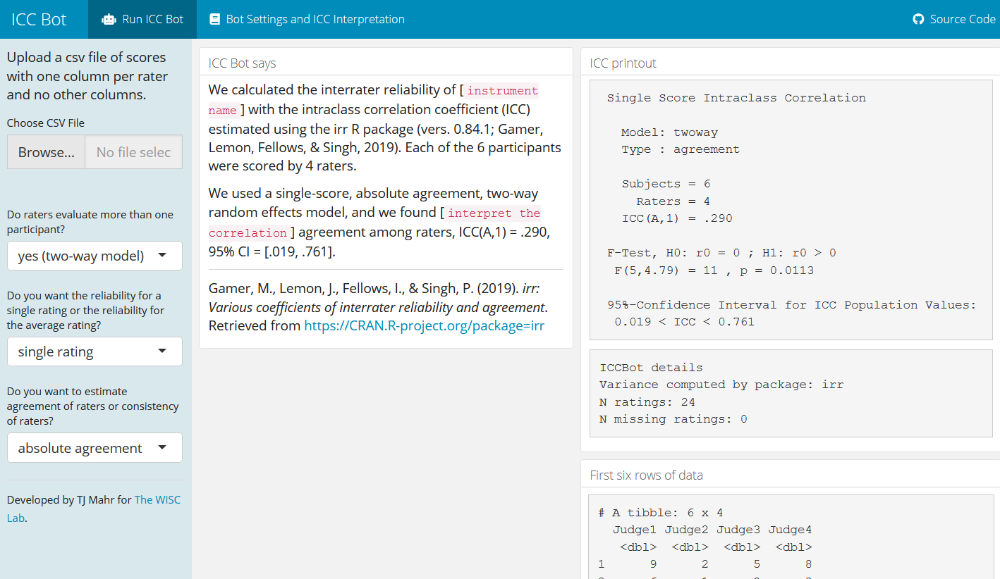

<!-- README.md is generated from README.Rmd. Please edit that file -->

```{r, include = FALSE}
knitr::opts_chunk$set(
  collapse = TRUE,
  comment = "#>",
  fig.path = "man/figures/README-",
  out.width = "100%"
)
```

# ICC Bot

<!-- badges: start -->
<!-- badges: end -->

ICC Bot is a Shiny app for computing intraclass correlation coefficients to
estimate interrater reliability.

You can install and run the app (locally):

```{r, eval = FALSE}
# remotes::install_github("tjmahr/iccbot")
iccbot::run_app()
```



***

Supported by NIH R01DC009411 and NIH R01DC015653.

Please note that the 'iccbot' project is released with a
[Contributor Code of Conduct](.github/CODE_OF_CONDUCT.md).
By contributing to this project, you agree to abide by its terms.

